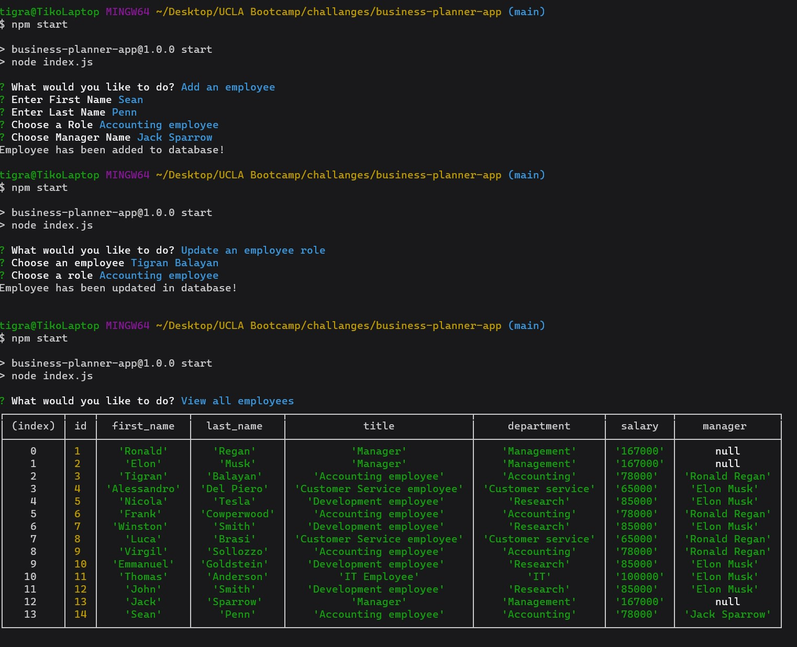
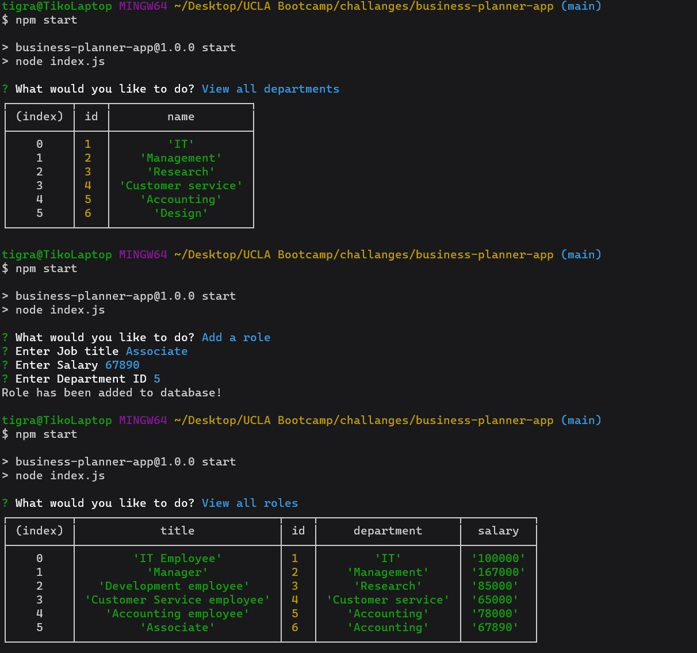

# Business Planner

## Demonstration Screenshots

## Purpose
Plan business by managing employees database, with adding, updating and viewing employees and their roles.

## Built With
* 
* 
* 
* 

## Demonstration Video link
https://www.youtube.com/watch?v=kdZTFWN_jWo

## GitHub Repository Link
https://github.com/TigranBalayan10/business-planner-app

## Contribution
Made by Tigran Balayan